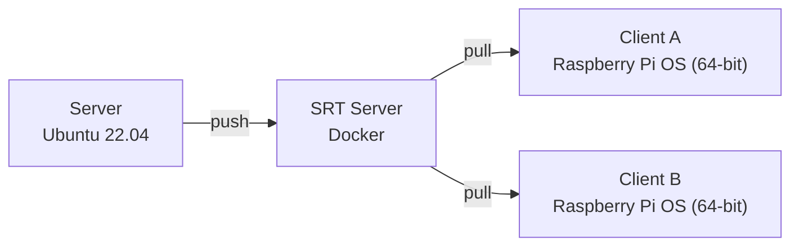

# multi-screen

## Project Overview



## Prepare Project

1. Clone the project
2. Load CMake project (The `Server` will be compiled during the CMake loading)
3. Compile the `Client` (the player)
4. Setup `SRT Server`
5. Setup `Server`
6. Setup `Client`

### Clone the project

Clone the project on `Server` and all `Client(s)`

```shell
git clone https://github.com/hwsel/multi-screen.git
```

### Load CMake project

On all machines that have cloned repo.

```shell
cmake \
-DEP_BUILD_ALWAYS=<force_build_externals> \
-DEP_J=<max_jobs> \
-DCMAKE_BUILD_TYPE=Debug \
-DCMAKE_MAKE_PROGRAM=<ninja_path> \
-G Ninja \
-S <project_root> \
-B <project_root>/cmake-build-debug
```

- `<project_root>` is where your project located.
- `<ninja_path>` is where your `ninja` program located or installed, for example, `/usr/bin/ninja`.
- `<max_jobs>` is the `-j` option in `make` and `ninja` depends on your CPU capacity, default is set to 3 when cpu cores < 4, otherwise set to 36. (36 is based on my CPU cores capacity, you may need to change it.)
- `<force_build_externals>` is the option if you need the build process for those externals, default is set to `1L` to build them.

For example, from last step, on `Server`: `cd multi-screen && cmake -DEP_BUILD_ALWAYS=1L -DEP_J=36 -DCMAKE_BUILD_TYPE=Debug -DCMAKE_MAKE_PROGRAM=/usr/bin/ninja -G Ninja -S . -B ./cmake-build-debug`.
Foe example, form last step, on `Client`: `cd multi-screen && cmake -DEP_BUILD_ALWAYS=1L -DEP_J=3 -DCMAKE_BUILD_TYPE=Debug -DCMAKE_MAKE_PROGRAM=/usr/bin/ninja -G Ninja -S . -B ./cmake-build-debug`

In this step, the server-side program is compiled along with FFmpeg. So, no need to compile them explicitly.

### Compile the `Client`

On all `Client(s)`, you need to comple the client's player. 

```shell
cmake \
--build <project_root>/cmake-build-debug \
--clean-first \
--target player \
-j 3
```

- `<project_root>` is where your project located.

For example, from last step, on `Client`: `cmake --build ./cmake-build-debug --clean-first --target player -j 3`.

It's not a huge application, so `-j 3` should be fine both on Raspberry Pi and normal PC (that plays the `Server` role).

### Setup `SRT Server`

Please refer to the Docker's website and documents to install Docker on your machine: [https://docs.docker.com/engine/install/ubuntu/](https://docs.docker.com/engine/install/ubuntu/)

After you finish installing Docker, please pull and run the following container.

```shell
sudo docker run \
--rm \
-it \
-p 1935:1935 \
-p 1985:1985 \
-p 8080:8080 \
-p 10080:10080/udp \
ossrs/srs:5 \
./objs/srs -c conf/srt.conf
```

If you have a firewall setup, please allow those ports access (1935, 1985, 8080, 10080).

And the IP address of this machine will be denoted as `<SRT IP>`.

### Setup `Server`

In this step, you'll send something to the `SRT Server` using FFmpeg. If you're not familiar with FFmpeg, you can just use the command below. But any changes based on your need are always welcome.

```shell
SEI=681d5c8f-80cd-4847-930a-99b9484b4a32+000000 \
./cmake-build-debug/external/Install/bin/ffmpeg \
-y \
-re \
-f lavfi -i testsrc=s=3840x1080:r=30 \
-filter_complex "\
color=c=black:s=3840x1080[main];\
[main][0:v]overlay=x=0:y=0[main];\
[main]split=3[mon][mon1][mon2];\
[mon1]crop=w=1920:h=1080:x=0:y=0[mon1];\
[mon2]crop=w=1920:h=1080:x=1920:y=0[mon2]" \
-map "[mon]" \
-an -c:v libx264 \
-bsf:v h264_metadata=sei_user_data=$SEI \
-pes_payload_size 0 -bf 0 \
-f mpegts "srt://<SRT IP>:10080?streamid=#!::r=live/test,m=publish" \
-map "[mon1]" \
-an -c:v libx264 \
-bsf:v h264_metadata=sei_user_data=$SEI \
-pes_payload_size 0 -bf 0 \
-f mpegts "srt://<SRT IP>:10080?streamid=#!::r=live/test1,m=publish" \
-map "[mon2]" \
-an -c:v libx264 \
-bsf:v h264_metadata=sei_user_data=$SEI \
-pes_payload_size 0 -bf 0 \
-f mpegts "srt://<SRT IP>:10080?streamid=#!::r=live/test2,m=publish"
```

The command above generates a 3840x1080 video testing source (two 1920x1080s). The video source is then streamed to `srt://<SRT IP>:10080?streamid=#!::r=live/test,m=publish`. Meanwhile, it streams the left half of it to `srt://<SRT IP>:10080?streamid=#!::r=live/test1,m=publish`, and right half to `srt://<SRT IP>:10080?streamid=#!::r=live/test2,m=publish`.

### Setup `Client`

This is the last step, using the following command.

```shell
./cmake-build-debug/player/player 'srt://<SRT IP>:10080?streamid=#!::r=live/test1,m=publish'
```

or

```shell
./cmake-build-debug/player/player 'srt://<SRT IP>:10080?streamid=#!::r=live/test2,m=publish'
```
 And you can see the outputs on the screen. It's not full-screened, for an easier debugging :(.
 